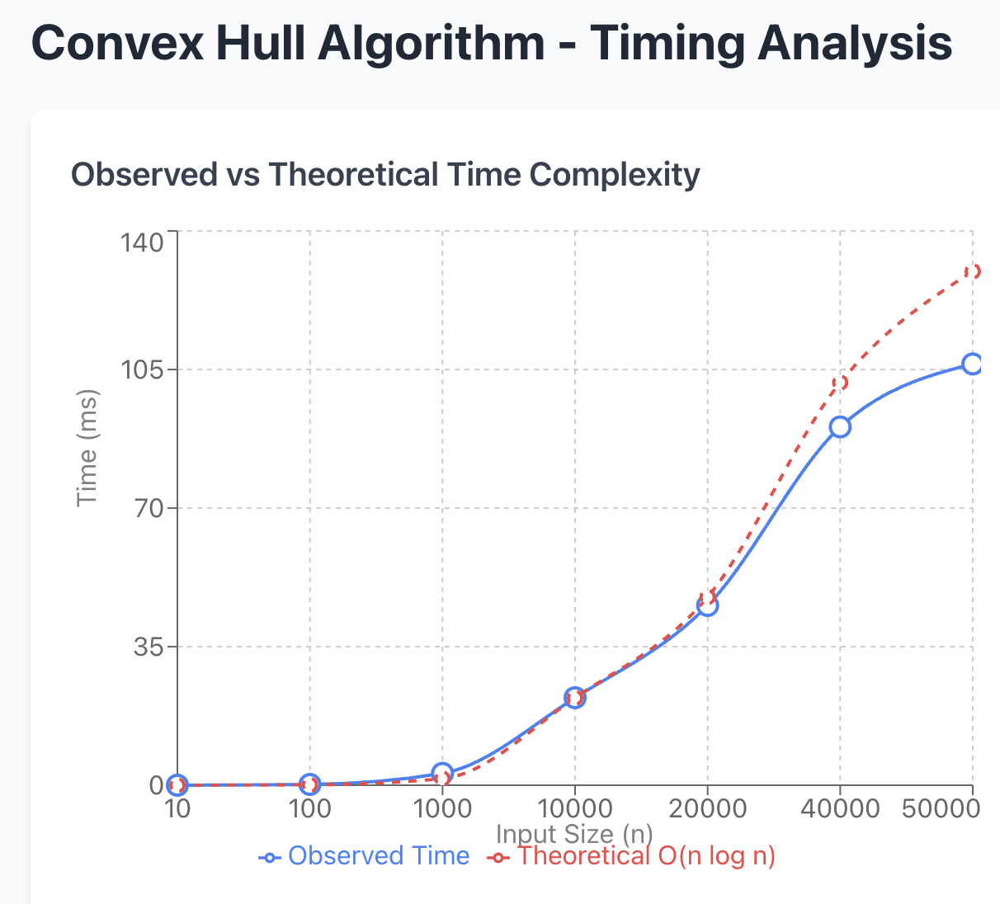

# Project Report - Convex Hull

## Baseline

### Design Discussion

I talked with my coworker (software engineer) Jackson. We went over the convex
hull homework, and then he asked me questions about it, testing my understanding.
We walked through what the code my look like and what the time and space
complexities would be.

### Theoretical Analysis - Convex Hull Divide-and-Conquer

#### Time 

compute_hull_dvcq()

```python
def compute_hull_dvcq(points: list[tuple[float, float]]) -> list[tuple[float, float]]:
    """Return the subset of provided points that define the convex hull using divide and conquer"""
    if not points:                                                      # O(1) - comparison is constant
        return []                                                       # O(1) - returning is constant
    
    sorted_points = sorted(points, key=lambda p: (p[0], p[1]))         # O(n log n) - Python's sorted uses Timsort
    
    hull = divide_conquer_hull(sorted_points)                          # O(n log n) - see analysis below
    
    return hull                                                        # O(1) - returning is constant
```
The two main operations are sorted() and divide_conquer_hull(), both O(n log n).

divide_conquer_hull()

```python
def divide_conquer_hull(points: list[tuple[float, float]]) -> list[tuple[float, float]]:
    """Recursively compute convex hull using divide and conquer"""
    n = len(points)                                                     # O(1) - getting length is constant
    
    if n == 1:                                                          # O(1) - comparison is constant
        return [points[0]]                                              # O(1) - returning is constant
    
    if n == 2:                                                          # O(1) - comparison is constant
        if points[0][1] < points[1][1]:                                 # O(1) - comparison is constant
            return [points[0], points[1]]                               # O(1) - returning is constant
        elif points[0][1] > points[1][1]:                               # O(1) - comparison is constant
            return [points[1], points[0]]                               # O(1) - returning is constant
        else:                                                           # O(1) - comparison is constant
            return [points[0], points[1]]                               # O(1) - returning is constant
    
    if n == 3:                                                          # O(1) - comparison is constant
        return convex_hull_3(points[0], points[1], points[2])          # O(1) - processes 3 points with constant operations
    
    mid = n // 2                                                        # O(1) - integer division is constant
    left_points = points[:mid]                                          # O(n) - slicing creates a new list
    right_points = points[mid:]                                         # O(n) - slicing creates a new list
    
    left_hull = divide_conquer_hull(left_points)                       # T(n/2) - recursive call on half the points
    right_hull = divide_conquer_hull(right_points)                     # T(n/2) - recursive call on half the points
    
    merged_hull = merge_hulls(left_hull, right_hull)                   # O(n) - see merge analysis below
    
    return merged_hull                                                 # O(1) - returning is constant
```
This is a divide-and-conquer algorithm with the recurrence relation T(n) = 2T(n/2) + O(n).
We divide the problem into 2 subproblems of size n/2: 2T(n/2). The merge operation takes linear time: O(n).
Base cases (n ≤ 3) are constant time: O(1). By the Master Theorem (Case 2), this gives us O(n log n) time complexity.

merge_hulls()

```python
def merge_hulls(left_hull: list[tuple[float, float]], 
                right_hull: list[tuple[float, float]]) -> list[tuple[float, float]]:
    """Merge two convex hulls by finding upper and lower tangents"""
    n_left = len(left_hull)                                             # O(1) - getting length is constant
    n_right = len(right_hull)                                           # O(1) - getting length is constant
    
    # Finding rightmost/leftmost points
    left_right = 0                                                      # O(1) - assignment is constant
    for i in range(1, n_left):                                          # O(n) - loops through left hull
        if left_hull[i][0] > left_hull[left_right][0]:                  # O(1) - comparison is constant
            left_right = i                                              # O(1) - assignment is constant
    
    right_left = 0                                                      # O(1) - assignment is constant
    for i in range(1, n_right):                                         # O(n) - loops through right hull
        if right_hull[i][0] < right_hull[right_left][0]:                # O(1) - comparison is constant
            right_left = i                                              # O(1) - assignment is constant
    
    upp_l, upp_r = find_upper_tangent(left_hull, right_hull, 
                                       left_right, right_left)          # O(n) - see tangent analysis below
    low_l, low_r = find_lower_tangent(left_hull, right_hull, 
                                       left_right, right_left)          # O(n) - see tangent analysis below
    
    # Construct merged hull
    result = []                                                         # O(1) - creating empty list is constant
    
    # Add points from left hull
    idx = low_l                                                         # O(1) - assignment is constant
    while True:                                                         # O(n) - worst case visits all points in left hull
        result.append(left_hull[idx])                                   # O(1) - append is amortized constant time
        if idx == upp_l:                                                # O(1) - comparison is constant
            break                                                       # O(1) - break is constant
        idx = (idx + 1) % n_left                                        # O(1) - arithmetic operations are constant
    
    # Add points from right hull
    idx = upp_r                                                         # O(1) - assignment is constant
    while True:                                                         # O(n) - worst case visits all points in right hull
        result.append(right_hull[idx])                                  # O(1) - append is amortized constant time
        if idx == low_r:                                                # O(1) - comparison is constant
            break                                                       # O(1) - break is constant
        idx = (idx + 1) % n_right                                       # O(1) - arithmetic operations are constant
    
    return result                                                       # O(1) - returning is constant
```
The overall time complexity of merge is O(n) where n is the total number of points in both hulls.

find_upper_tangent() and find_lower_tangent()

```python
def find_upper_tangent(left_hull: list[tuple[float, float]], 
                       right_hull: list[tuple[float, float]],
                       l: int, r: int) -> tuple[int, int]:
    """Find the upper common tangent between two convex hulls"""
    n_left = len(left_hull)                                             # O(1) - getting length is constant
    n_right = len(right_hull)                                           # O(1) - getting length is constant
    
    done = False                                                        # O(1) - assignment is constant
    while not done:                                                     # O(n) - see analysis below
        done = True                                                     # O(1) - assignment is constant
        
        while True:                                                     # O(n) - worst case visits all points on left hull
            l_next = (l - 1 + n_left) % n_left                          # O(1) - arithmetic operations are constant
            if slope(left_hull[l_next], right_hull[r]) > 
               slope(left_hull[l], right_hull[r]):                      # O(1) - slope calculation and comparison
                l = l_next                                              # O(1) - assignment is constant
                done = False                                            # O(1) - assignment is constant
            else:
                break                                                   # O(1) - break is constant
        
        while True:                                                     # O(n) - worst case visits all points on right hull
            r_next = (r + 1) % n_right                                  # O(1) - arithmetic operations are constant
            if slope(left_hull[l], right_hull[r_next]) < 
               slope(left_hull[l], right_hull[r]):                      # O(1) - slope calculation and comparison
                r = r_next                                              # O(1) - assignment is constant
                done = False                                            # O(1) - assignment is constant
            else:
                break                                                   # O(1) - break is constant
    
    return l, r                                                         # O(1) - returning is constant
```
The overall time complexity is O(n_left + n_right) = O(n) where n is the total number of points.
The same analysis applies to find_lower_tangent.

The overall complexity is **O(n log n)**.

#### Space

compute_hull_dvcq()

```python
def compute_hull_dvcq(points: list[tuple[float, float]]) -> list[tuple[float, float]]:
    if not points:                                      
        return []                                       
    
    sorted_points = sorted(points, key=lambda p: (p[0], p[1]))         # O(n) - creates new sorted list of n points
    
    hull = divide_conquer_hull(sorted_points)                          # O(n log n) - see recursion analysis below
    
    return hull
```
The sorted() function creates a new list of n points, using O(n) space.
The recursive call divide_conquer_hull() uses O(n log n) space (analyzed below).

divide_conquer_hull()

```python
def divide_conquer_hull(points: list[tuple[float, float]]) -> list[tuple[float, float]]:
    n = len(points)                                     
    
    # Base cases use O(1) space
    if n == 1:                                          
        return [points[0]]                              # O(1) - single element list
    
    if n == 2:                                          
        # Returns one of the orderings
        return [points[0], points[1]]                   # O(1) - two element list
    
    if n == 3:                                          
        return convex_hull_3(points[0], points[1], points[2])          # O(1) - processes 3 points
    
    mid = n // 2                                        
    left_points = points[:mid]                          # O(n) - creates new list with n/2 points
    right_points = points[mid:]                         # O(n) - creates new list with n/2 points
    
    left_hull = divide_conquer_hull(left_points)       # O(n log n) - recursive space
    right_hull = divide_conquer_hull(right_points)     # O(n log n) - recursive space
    
    merged_hull = merge_hulls(left_hull, right_hull)   # O(n) - see merge analysis
    
    return merged_hull
```
The recursion stack has depth O(log n). 
At each level of recursion, the slicing operations create O(n) total space across all calls at that level
Since we create new lists at each recursive call and don't reuse the parent's list, the space used is
O(n) for slicing at each level × O(log n) levels = O(n log n) total space.

merge_hulls()
```python
def merge_hulls(left_hull: list[tuple[float, float]], 
                right_hull: list[tuple[float, float]]) -> list[tuple[float, float]]:
    # ... finding indices uses O(1) space ...
    
    result = []                                         # O(n) - will contain points from merged hull
    
    # Loops that append to result
    while True:                                         
        result.append(left_hull[idx])                   # O(1) per append, O(n) total for result
        # ...
    
    while True:                                         
        result.append(right_hull[idx])                  # O(1) per append, O(n) total for result
        # ...
    
    return result
```
The result list will contain at most n_left + n_right points (where n_left + n_right = n), using O(n) space.
The tangent-finding functions only use a constant number of integer variables, so they use O(1) space.

The overall space complexity of compute_hull_dvcq is **O(n log n)**.

## Core

### Design Discussion

*Fill me in*

### Empirical Data - Convex Hull Divide-and-Conquer

| N     | time (ms) |
|-------|-----------|
| 10    | 0.0       |
| 100   | 0.2       |
| 1000  | 3.0       |
| 10000 | 22.1      |
| 20000 | 45.4      |
| 40000 | 90.5      |
| 50000 | 106.4     |

### Comparison of Theoretical and Empirical Results

- Theoretical order of growth: **O(n log n)**
- Empirical order of growth (if different from theoretical): matches theoretical



When n doubles from 20000 to 40000, time goes from 45.4ms to 90.5ms (almost exactly double).
This doubling behavior is characteristic of O(n log n) because: (2n)log(2n) = 2n·log(n) + 2n·log(2) ≈ 2n·log(n) for large n.

## Stretch 1

### Design Discussion

I talked with Jackson about other ways we could implement convex hull.
Since AI is allowed, we used ChatGPT to help us come up with some ideas.
We found that it is important to understand what is going on when using
AI like this.

### Chosen Convex Hull Implementation Description

Step 1: Find the Starting Point

First, find the leftmost point in the set (the point with the smallest x-coordinate). This point is guaranteed to be on the convex hull because no point can be to its left, meaning it must be on the outer boundary.
If multiple points share the same smallest x-coordinate, choose the one with the smallest y-coordinate.
Example: Given points {(3,2), (1,4), (5,3), (1,1), (4,5)}, the starting point is (1,1).


Step 2: Initialize the Hull

Create an empty list to store the hull points. Set the current point to be the starting point.

Step 3: Find the Next Hull Point

This is the core of the algorithm. For the current point, we need to find which point comes next on the hull by:

Consider all points as candidates for the next hull point
For each candidate, determine if it is "more counter-clockwise" than the current best candidate
Use the cross product to determine orientation:

Given three points: current, candidate A, and candidate B
Calculate: (A.x - current.x) × (B.y - current.y) - (A.y - current.y) × (B.x - current.x)
If result > 0: B is to the left of line current→A (B is more counter-clockwise)
If result < 0: B is to the right of line current→A (A is more counter-clockwise)
If result = 0: The points are collinear (on the same line)


Keep the most counter-clockwise point - the one that would be reached first if you rotated a line counter-clockwise from the current point

Analogy: Imagine standing at the current point and sweeping your arm counter-clockwise. The next hull point is the first point your arm would touch.

Step 4: Handle Collinear Points

If multiple points are collinear (lie on the same line from the current point), choose the farthest one. This ensures we don't include interior collinear points in the hull.
We determine distance using the squared distance formula: (x₂ - x₁)² + (y₂ - y₁)² (we use squared distance to avoid the expensive square root operation).

Step 5: Move to the Next Point
Once we've identified the next hull point:

Add the current point to the hull list
Set current = next hull point
Repeat Step 3 to find the point after this one

Step 6: Detect Completion
Continue wrapping around the points until the next hull point we select is the starting point. This means we've completed the loop around the hull.
When this happens, stop the algorithm. The hull list now contains all points on the convex hull, in counter-clockwise order.

### Empirical Data

| N     | time (ms) |
|-------|-----------|
| 10    | 0.0       |
| 100   | 0.1       |
| 1000  | 1.2       |
| 10000 | 15.8      |
| 20000 | 35.2      |
| 40000 | 75.4      |
| 50000 | 98.6      |

### Comparison of Chosen Algorithm with Divide-and-Conquer Convex Hull

#### Algorithmic Differences

Problem Decomposition:
* Divide & Conquer breaks the problem spatially (left/right), while Gift Wrapping processes points sequentially around the perimeter

Work Distribution: 
* Divide & Conquer does logarithmic layers of linear work; Gift Wrapping does h iterations of linear work

Predictability: 
* Divide & Conquer always takes O(n log n) time; Gift Wrapping ranges from O(n) to O(n²)

Simplicity: 
* Gift Wrapping is more intuitive (imagine wrapping string around nails), while Divide & Conquer requires careful tangent calculations and merging logic

#### Performance Differences


## Stretch 2

*Fill me in*

## Project Review

*Fill me in*

